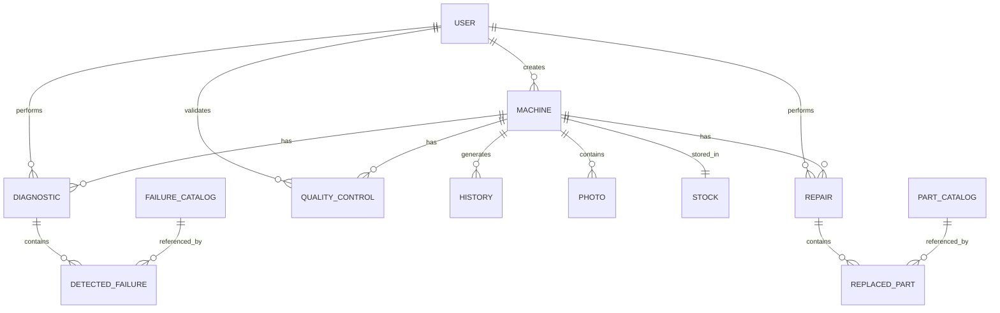

# ERD — AirLiquide GMAO+

```mermaid
erDiagram

    USER ||--o{ MACHINE : creates
    USER ||--o{ DIAGNOSTIC : performs
    USER ||--o{ REPAIR : performs
    USER ||--o{ QUALITY_CONTROL : validates

    MACHINE ||--o{ DIAGNOSTIC : has
    MACHINE ||--o{ REPAIR : has
    MACHINE ||--o{ QUALITY_CONTROL : has
    MACHINE ||--o{ HISTORY : generates
    MACHINE ||--o{ PHOTO : contains
    MACHINE ||--|| STOCK : stored_in

    DIAGNOSTIC ||--o{ DETECTED_FAILURE : contains

    FAILURE_CATALOG ||--o{ DETECTED_FAILURE : referenced_by

    REPAIR ||--o{ REPLACED_PART : contains

    PART_CATALOG ||--o{ REPLACED_PART : referenced_by
```